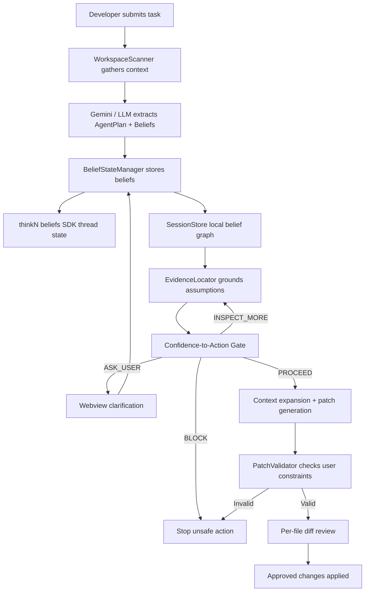

# BeliefGuard Architecture

BeliefGuard is a VS Code extension that inserts a belief-aware control plane between a developer and an AI coding agent. The central design choice is to separate planning from execution: the model must first expose assumptions, then the system validates those assumptions before any patch can be generated or applied.

## Core Data Model

BeliefGuard represents uncertainty as typed graph nodes:

- `REPO_FACT`: observed facts from files or manifests.
- `TASK_BELIEF`: constraints inferred from the user task.
- `AGENT_ASSUMPTION`: model assumptions that need grounding.
- `USER_CONSTRAINT`: validated human clarification that overrides conflicting assumptions.
- `Evidence`: file/config/user-answer artifacts that support a belief.

Edges are intentionally simple:

- `SUPPORTED_BY`
- `CONTRADICTED_BY`

The graph is intentionally lightweight rather than a full semantic index. That keeps the extension fast enough for a hackathon demo while still creating a deterministic safety boundary before code generation.

## Gate Policy

The gate returns one of four decisions:

- `BLOCK`: a belief contradicts a repository fact or user constraint.
- `ASK_USER`: high-risk uncertainty remains unresolved.
- `INSPECT_MORE`: low-confidence belief needs more evidence.
- `PROCEED`: all blocking conditions are cleared.

This policy is deterministic and testable, which is the main engineering distinction from prompt-only safety instructions.

## Patch Channel

BeliefGuard prefers structured patches over direct workspace mutation:

1. The model emits a structured patch envelope.
2. The validator checks it against user constraints.
3. The webview presents each file change.
4. The developer approves or rejects each file independently.
5. Only approved file patches are applied.

This makes the final mutation path auditable and reversible at the user-decision level.
